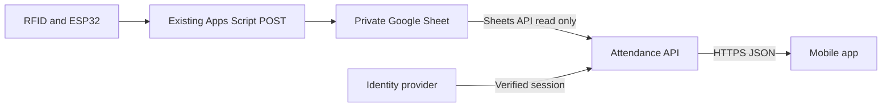

co# Mobile attendance implementation plan

> Historical planning record. Implementation now uses Flutter, a Render-ready API, and personal leadership access codes. Firebase/Cloud Run proposals below are superseded. See [current setup](setup.md) and [verification](verification.md).
## Scope and proposed defaults

Build an Android-first club app, with an iOS-compatible codebase. MVP: authenticated access, an inside-now dashboard, member search, member profiles, chronological attendance history, and clear loading/offline/error states. Club activity means recorded attendance; the current sheet cannot identify meetings, projects, or event participation.

Confirmed mobile framework: Flutter with Dart. Proposed backend: Node.js/TypeScript on Google Cloud Run. Proposed login: Firebase Authentication with Google sign-in and a server-side approved-user list. Use an OpenAPI contract to keep Dart client models and TypeScript server models consistent; the languages cannot share TypeScript source types. Initially allow approved club administrators to view the directory and histories. Member self-service requires a verified account-to-registration mapping; never treat an RFID UID or typed registration number as login proof.

Flutter is selected by the project owner. Android-first delivery, hosting, login provider, and access policy are proposed defaults pending owner decisions. No software has been installed and no application code or cloud resources have been created. See [hosting](hosting.md), [Flutter environment](flutter-environment.md), and [delivery sequence](delivery-plan.md).

## Architecture

Keep the existing writer and its health-check GET endpoint intact. Add a separate backend that reads `'Zairza Attendance'!A:H` using the Google Sheets API. Share the spreadsheet as Viewer with its service account and request the read-only Sheets scope. Credentials stay on the server. A private spreadsheet must not be published as CSV or accessed using a credential embedded in the app.

For the small-club MVP, read the complete sheet into one validated snapshot and cache it per API instance for 30 seconds. Coalesce concurrent refreshes within each instance, use bounded retries with backoff, and keep the last successful in-memory snapshot on transient failures. This cache disappears when an instance restarts or scales down. Different instances may hold different snapshots; no distributed cache is implied. After a cold start with Sheets unavailable, return 503 and let the app show its account-scoped local cache. Expired or unavailable snapshot cursors return 409 and restart pagination. Refresh on demand while the app is active; no always-on worker is required initially. Return snapshot ID, source-read timestamp, freshness, and data-quality counts with responses. Never present an upstream failure as an empty club.

The app polls every 30 seconds while foregrounded and supports pull-to-refresh. Background polling stops. Target roughly one minute visibility after a row becomes available in Sheets under normal service conditions, not instant delivery. Device-offline scans remain invisible until uploaded. Stale status begins after 90 seconds without a successful source refresh.

No attendance database is required for the first small deployment. Authentication/allowlist configuration is separate from attendance storage. A later database-backed read model can support larger history volumes, verified member identities, and audit corrections without changing the hardware writer. Benchmark full-sheet reads at the expected retained volume before launch; use a persistent read model if the latency or quota budget is unacceptable.

## Screens

| Screen | Contents and behavior |
|---|---|
| Sign in | Managed login, approved-user access, recoverable failure, sign out |
| Inside now | Count, member cards, latest check-in, search, last refresh, stale banner |
| Members | Search by name/registration, branch filter, recorded presence |
| Member profile | Latest valid name/registration/branch, presence, last scan, visits, completed duration |
| History | Date range, paginated raw scan timeline, paired visits, incomplete/anomalous markers |
| Settings | Session, connection state, data refresh details |

Profiles are initially derived from attendance, so members who have never scanned will not appear. Avatars can use initials. Profile editing, photos, notifications, leaderboards, attendance corrections, and event management are deferred.

## Delivery sequence and acceptance gates

1. **Repository and specification (this change).** Preserve firmware, archive writer, document schema, assumptions, contracts, and fixtures. Gate: unchanged firmware checksum and coherent documentation.
2. **Domain and contracts.** Implement header mapping, parsing, deduplication, ordering, presence reduction, and visit pairing as pure TypeScript functions. Gate: deterministic tests for the edge cases in data-rules.md; sample data yields one real member, outside, with a one-minute visit when the test record is excluded.
3. **API and identity.** Implement mock source first, then Sheets adapter, per-instance snapshot cache, validated query inputs, managed token verification, approved-user authorization, pagination, and errors. Gate: anonymous access denied; no write scope; Sheets outages retain explicitly stale data; concurrent requests on one instance share one refresh; restart and cross-instance cursor failures recover cleanly.
4. **Mobile vertical slice.** Implement login → inside dashboard → profile → history against fixtures and the API. Add search, pagination, accessibility labels, large text support, local snapshot cache, and all empty/error states. Gate: physical Android device can navigate complete flow; cached data is cleared on sign-out and cannot leak between accounts.
5. **Live integration.** Configure a private test sheet with the same columns, identity provider, and test API deployment. Compare dashboard/history with known rows, delayed uploads, and date boundaries. Then connect the production sheet with Viewer access. Gate: real scan appears after normal refresh, check-out removes member, no source writes occur, expired sessions fail safely.
6. **Release and operations.** Produce an installable Android release build, validate on physical devices, configure HTTPS, secrets, minimal operational logs, health monitoring, and deployment rollback. Gate: fresh install/login works, offline/reconnect behavior passes, release artifact and setup/runbook are documented. Add iOS signing/distribution when needed.

## Verification matrix

- Domain: duplicate IDs, conflicting duplicate IDs, repeated actions, checkout without check-in, test rows, invalid rows, UID normalization, identity conflicts, same-minute scans, midnight and delayed uploads.
- API: access denial, expired tokens, upstream timeout/quota failure, schema mismatch, empty valid sheet, pagination against a fixed snapshot, recovery after restart.
- UI: empty club vs unavailable data, stale state, refresh failure, profile with incomplete visit, long names, search with no results, timezone rendering, sign-out cache removal.
- Integration: compare counts and histories to controlled source rows; check both latest presence and completed durations. Do not modify production attendance to run tests.

## Decisions needed before live implementation

Confirm Android-only launch or Android+iOS; administrators-only visibility or member access; login provider and approved-user list; treatment of test records; long-running presence policy; and whether multiple/reassigned cards are in use. Defaults and unresolved identity limitations are in data-rules.md. The spreadsheet ID, service-account Viewer access, and deployment environment are external setup inputs.

## Technical references

- [Google Sheets read-only scope](https://developers.google.com/workspace/sheets/api/scopes): scope is spreadsheet-wide, not restricted to an individual tab. Use a dedicated attendance spreadsheet where possible.
- [Flutter Android setup](https://docs.flutter.dev/platform-integration/android/setup): install the SDK/toolchain, validate with flutter doctor, and test on an Android device.
- [Firebase Flutter login](https://firebase.google.com/docs/auth/flutter/federated-auth): proposed Google sign-in integration.
- [Cloud Run service identity](https://docs.cloud.google.com/run/docs/securing/service-identity): backend credentials through an attached service account.
